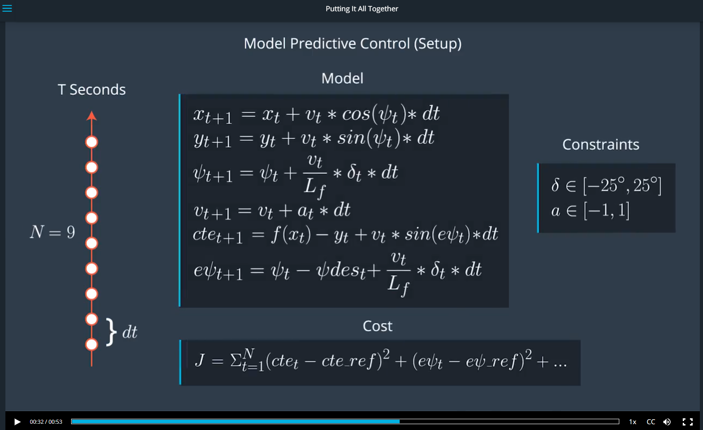

#  Model Predictive Control(MPC) Project Starter Code
Self-Driving Car Engineer Nanodegree Program

In this project I will utilize a MPC Controller in the simulator. 

The goals / steps of this project are the following:

* 1.Your code should compile.
* 2.The Model.
* 3.Timestep Length and Elapsed Duration (N & dt).
* 4.Polynomial Fitting and MPC Preprocessing.
* 5.Model Predictive Control with Latency.
* 6.The vehicle must successfully drive a lap around the track.


### [Rubric](https://review.udacity.com/#!/rubrics/896/view) Points
### Here I will consider the rubric points individually and describe how I addressed each point in my implementation.  

#### 1.Your code should compile.
I compile project by following instructions:

1. mkdir build
2. cd build
3. cmake ..
4. make
5. ./mpc

#### 2.The Model.
Here is the MPC formula from classroom:
<div class="test">

</div>


#### 3.Timestep Length and Elapsed Duration (N & dt).
The N and dt were chose:
N = 10
dt = 0.05

I tried some values by below:
N = 20 & dt = 0.025
N = 25 & dt = 0.02
N = 10 & dt = 0.05
N = 8 & dt = 0.05
N = 15 & dt = 0.05
...

Finally I chose N = 10 & dt = 0.05 , because they are relatively stable.


#### 4.Polynomial Fitting and MPC Preprocessing.
I used polyfit function from classroom.
Here is a code fragment in main.cpp:

```
	Eigen::VectorXd polyfit(Eigen::VectorXd xvals, Eigen::VectorXd yvals,
	                        int order) {
	  assert(xvals.size() == yvals.size());
	  assert(order >= 1 && order <= xvals.size() - 1);
	  Eigen::MatrixXd A(xvals.size(), order + 1);
	
	  for (int i = 0; i < xvals.size(); i++) {
	    A(i, 0) = 1.0;
	  }
	
	  for (int j = 0; j < xvals.size(); j++) {
	    for (int i = 0; i < order; i++) {
	      A(j, i + 1) = A(j, i) * xvals(j);
	    }
	  }
	
	  auto Q = A.householderQr();
	  auto result = Q.solve(yvals);
	  return result;
	}
```

In the MPC preprocessing £¬I referenced some [code](https://classroom.udacity.com/nanodegrees/nd013/parts/40f38239-66b6-46ec-ae68-03afd8a601c8/modules/f1820894-8322-4bb3-81aa-b26b3c6dcbaf/lessons/338b458f-7ebf-449c-9ad1-611eb933b076/concepts/ee21948d-7fad-4821-b61c-0d69bbfcc425) from classroom.
Additionally I add a brake control to the MPC
Here is a code fragment in MPC.cpp:
```
    // The part of the cost based on the reference state.
    for (size_t t = 0; t < N; t++) {
      fg[0] += CppAD::pow(vars[cte_start + t], 2);
    }

    // If cte error to large , take a brake
    if(fg[0] >= 1){
       ref_v = ref_v / 1.4 + 10;
    }
    else{
       ref_v = 100;
    }

```


#### 5.Model Predictive Control with Latency.
In the MPC preprocessing ,I according to dt get a "latency value", then by the "latency value", chose the delta0 & a0 from state array.
Here is a code fragment in MPC.cpp:
```
      // add latency control 
      size_t latency = int(0.1 / dt);
      if (t >= latency){
          delta0 = vars[delta_start + t - latency];
          a0 = vars[a_start + t - latency];
      }
```

#### 5.The vehicle must successfully drive a lap around the track.
My car drove a lap around the track successfully.
Here's a [video link](./Docs/video.mp4) to my result